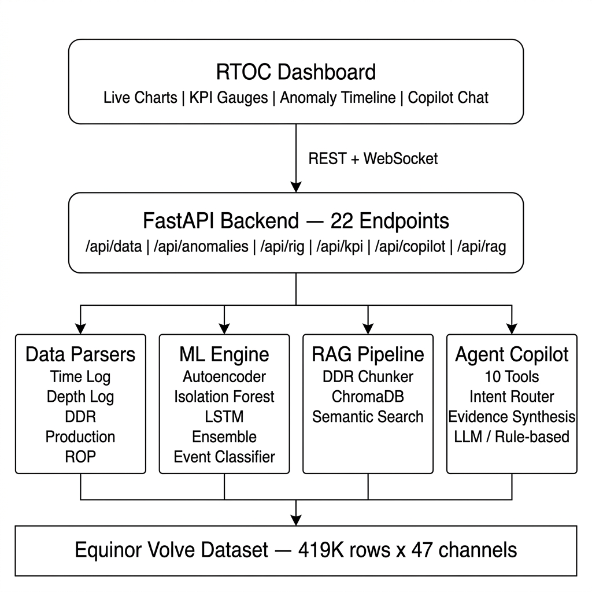

# DrillMind

**An AI copilot for real-time drilling operations — built on real data.**

DrillMind watches live drilling telemetry, detects anomalies before they become incidents, classifies rig states automatically, and answers plain-English questions about what's happening downhole. Think of it as having a senior drilling engineer who never sleeps, never gets distracted, and has instant recall of every daily report ever written on the field.

Built entirely on the [Equinor Volve open dataset](https://www.equinor.com/energy/volve-data-sharing) — 419,745 rows of real sensor data from a real well on the Norwegian Continental Shelf. No synthetic data. No mock services. Every column name verified against the actual CSV files.

---

## What It Does

### Anomaly Detection
Three ML models vote on whether something looks abnormal:
- **Autoencoder** (PyTorch) — learns what "normal" drilling looks like, flags anything it can't reconstruct
- **Isolation Forest** (scikit-learn) — catches multivariate outliers in a 261-dimensional feature space
- **LSTM Autoencoder** (PyTorch) — spots temporal anomalies across 60-timestep sliding windows

The ensemble combines all three (50% AE + 30% IF + 20% LSTM) and a rule-based classifier maps detections to actual drilling problems: kicks, lost circulation, stuck pipe, bit dysfunction, washout, or connection gas.

### Rig State Classification
Automatically determines what the rig is doing at any moment — drilling, reaming, circulating, tripping, making connections, or sitting static — using a decision tree over RPM, WOB, flow rate, and depth change rate.

### Drilling KPIs
Computes Mechanical Specific Energy (MSE), d-exponent, and corrected d-exponent in real-time. These tell you whether you're drilling efficiently or burning money turning the bit against rock that isn't breaking.

### DDR Search (RAG)
1,588 Daily Drilling Reports from the Volve field, chunked by activity blocks, embedded with `all-MiniLM-L6-v2`, and stored in ChromaDB. Ask "when did we last see lost circulation?" and get answers grounded in actual operational records.

### AI Copilot
A multi-tool agent with 10 domain-specialized tools. You ask a question in English, it figures out which data to look at (sensors? anomalies? KPIs? DDRs?), calls the right tools, and synthesizes an answer. Works with local LLMs (Ollama/Mistral), OpenAI, Anthropic, or a pure rule-based fallback that needs no API keys.

### RTOC Dashboard
ISA-101-compliant HMI with muted gray-scale palette, live-updating charts, KPI gauges, anomaly timeline, rig state indicator, and copilot chat. Designed for 12-hour shift operators who need situational awareness, not visual flair.

---

## Architecture

<p align="center">
  
</p>

---

## Quick Start

### Prerequisites
- Python 3.11+
- CUDA GPU (optional, but autoencoder + LSTM train ~10x faster)
- ~4 GB disk space for the Volve dataset + ChromaDB index

### 1. Clone and install

```bash
git clone https://github.com/ArokyaMatthew/DrillMind.git
cd DrillMind
pip install -e ".[all]"
```

### 2. Get the data

Download the Volve time-indexed drilling log from [Equinor's data portal](https://www.equinor.com/energy/volve-data-sharing) and place it in `data/raw/`:

```
data/raw/Norway-NA-15_47_9-F-9 A time.csv     # Required — 419K rows of drilling telemetry
data/raw/Norway-NA-15_47_9-F-9 A depth.csv     # Optional — depth-indexed LWD/MWD data
data/raw/ROP data .csv                          # Optional — ROP + petrophysics
data/raw/Volve production data.xlsx             # Optional — production history
```

The DDRs are loaded automatically from HuggingFace (`bengsoon/volve_alpaca`) — no manual download needed.

### 3. Train the models (first time only)

```bash
set DRILLMIND_RETRAIN=1
python -c "from drillmind.api.server import app; import uvicorn; uvicorn.run(app, host='0.0.0.0', port=8000)"
```

This takes about 15 minutes with a CUDA GPU. The models are saved to `data/models/` and loaded automatically on subsequent starts.

### 4. Run (after training)

```bash
python -c "from drillmind.api.server import app; import uvicorn; uvicorn.run(app, host='0.0.0.0', port=8000)"
```

Open `http://localhost:8000` in your browser. The dashboard starts streaming data immediately.

### Docker

```bash
docker compose up --build
```

---

## Project Structure

```
DrillMind/
├── config/
│   ├── settings.yaml              # Well metadata, replay speed, quality thresholds
│   └── column_registry.yaml       # Maps raw CSV headers → standardized names
├── dashboard/
│   ├── index.html                 # ISA-101 compliant HMI layout
│   ├── styles.css                 # Gray-scale palette, light/dark mode
│   └── app.js                     # Real-time charts, KPI gauges, copilot chat
├── src/drillmind/
│   ├── api/server.py              # FastAPI app — 22 REST endpoints + WebSocket
│   ├── config.py                  # YAML config loader + column registry
│   ├── agents/
│   │   ├── orchestrator.py        # Multi-tool agent with intent routing
│   │   └── tools.py               # 10 domain tools (sensors, KPIs, anomalies, etc.)
│   ├── copilot/
│   │   ├── engine.py              # LLM provider abstraction (Ollama, OpenAI, etc.)
│   │   ├── context_builder.py     # Builds operational context for prompts
│   │   └── prompt_templates.py    # Drilling-specific system + user prompts
│   ├── data/
│   │   └── quality.py             # Gap, spike, flatline, NaN detection
│   ├── models/
│   │   ├── anomaly_detection.py   # Autoencoder + Isolation Forest + Ensemble
│   │   ├── lstm_detector.py       # LSTM autoencoder for temporal anomalies
│   │   ├── event_classifier.py    # Rule-based anomaly → drilling problem classifier
│   │   ├── feature_engineering.py # 261 features from raw telemetry
│   │   ├── rig_state.py           # 8-state IADC rig activity classifier
│   │   └── drilling_kpis.py       # MSE, d-exponent, corrected d-exponent
│   ├── parsers/
│   │   ├── time_log_parser.py     # Volve time-indexed CSV loader
│   │   ├── depth_log_parser.py    # Depth-indexed LWD/MWD loader
│   │   ├── ddr_parser.py          # Daily Drilling Report parser (HuggingFace)
│   │   ├── rop_parser.py          # ROP + petrophysics loader
│   │   └── production_parser.py   # Production data (Excel) loader
│   ├── rag/
│   │   ├── chunker.py             # DDR → chunks with metadata preservation
│   │   └── store.py               # ChromaDB vector store + semantic search
│   └── streaming/
│       └── replay_engine.py       # WebSocket replay engine with speed control
├── tests/                         # Unit tests for parsers, features, quality, etc.
├── scripts/                       # Dev utilities and verification scripts
├── pyproject.toml                 # Python packaging + dependencies
├── Dockerfile                     # CPU container build
└── docker-compose.yml             # Single-command deployment
```

---

## API Endpoints

| Method | Endpoint | Description |
|--------|----------|-------------|
| GET | `/api/well/info` | Well metadata (name, field, operator, row count) |
| GET | `/api/data/timeseries` | Time-indexed sensor data with pagination |
| GET | `/api/data/depth` | Depth-indexed LWD/MWD log |
| GET | `/api/data/rop` | ROP + formation properties (porosity, perm) |
| GET | `/api/data/production` | Production data with well filtering |
| GET | `/api/anomalies/events` | Classified anomaly events with severity |
| GET | `/api/anomalies/scores` | Raw anomaly scores per timestamp |
| GET | `/api/anomalies/summary` | Anomaly rate, type/severity breakdown |
| GET | `/api/rig/state` | Per-sample rig state classification |
| GET | `/api/rig/summary` | Time-in-state percentages |
| GET | `/api/rig/transitions` | State change log |
| GET | `/api/kpi/values` | MSE, d-exponent time series |
| GET | `/api/kpi/summary` | KPI statistics |
| GET | `/api/quality/report` | Data quality (gaps, spikes, flatlines) |
| POST | `/api/copilot/query` | Ask the AI copilot anything |
| POST | `/api/rag/search` | Semantic search across DDRs |
| GET | `/api/health` | System health check |
| WS | `/ws/stream` | Real-time WebSocket data stream |

---

## Configuration

All settings live in `config/settings.yaml`:

```yaml
project:
  well: "15/9-F-9 A"
  field: "Volve"
  operator: "Equinor"

replay:
  speed_multiplier: 10     # 10x real-time replay

quality:
  gap_threshold_seconds: 30
  spike_zscore_threshold: 4.0
  flatline_window: 20
```

### Environment Variables

| Variable | Default | Description |
|----------|---------|-------------|
| `DRILLMIND_RETRAIN` | `0` | Set to `1` to force model retraining |
| `DRILLMIND_MAX_ROWS` | all | Limit rows for faster dev cycles |
| `DRILLMIND_LLM_PROVIDER` | `fallback` | LLM provider: `ollama`, `openai`, `anthropic`, `fallback` |
| `DRILLMIND_LLM_MODEL` | auto | Model name (e.g., `mistral`, `gpt-4o`) |

---

## The Volve Dataset

The [Volve field](https://en.wikipedia.org/wiki/Volve_oil_field) was an oil field in the Norwegian North Sea operated by Equinor from 2008-2016. When it was decommissioned, Equinor released the complete operational dataset — one of the largest public drilling datasets ever published. DrillMind uses well **15/9-F-9 A**, which has:

- **419,745 rows** of time-indexed telemetry (every ~4.5 seconds for 19 days)
- **47 sensor channels** after column standardization (from 239 raw)
- Surface measurements: WOB, RPM, torque, SPP, flow, hookload
- Mud properties: weight in/out, temperature, conductivity
- Gas readings: total gas, background gas, H2S
- Depth tracking: bit depth, hole depth, TVD

---

## What Would It Take to Go Live?

This system works end-to-end on historical replay. To connect it to a real rig's data stream, you'd need:

1. **WITSML/OPC-UA adapter** — receives rows from the rig's data hub instead of reading a CSV
2. **Incremental scoring** — process one row at a time instead of batch
3. **Alert routing** — send critical events to SMS/email/PA system
4. **Online retraining** — periodic model refresh as formation changes

The ML pipeline, classification logic, KPI engine, RAG search, and dashboard are all production-ready as-is.

---

## Tech Stack

- **Backend**: Python 3.11, FastAPI, Uvicorn
- **ML**: PyTorch (CUDA), scikit-learn
- **RAG**: ChromaDB, sentence-transformers (`all-MiniLM-L6-v2`)
- **Data**: pandas, NumPy
- **Frontend**: Vanilla HTML/CSS/JS (no framework — ISA-101 demands simplicity)
- **LLM**: Ollama (local), OpenAI, Anthropic, or rule-based fallback

---

## License

MIT
